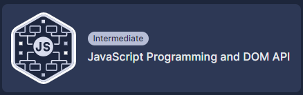
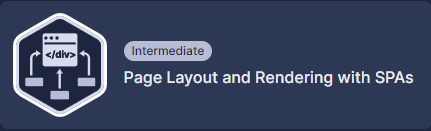
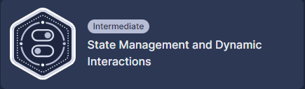
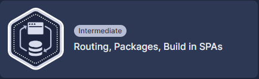

# Front-End Engineering with React

This learning path meticulously prepares a beginner to master React for frontend engineering. Gradually advancing from the basics to more complex topics, this pathway endows learners to create interactive, and scalable web applications using React by the end.

## Skills you'll learn

